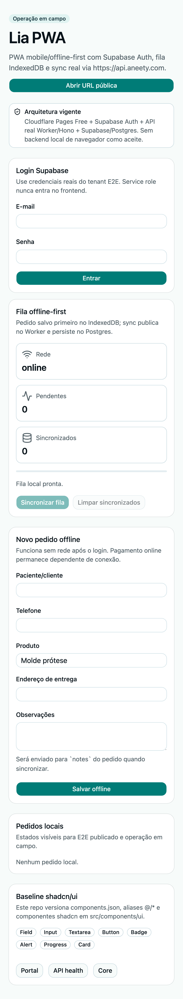

# lia-pwa

PWA mobile/offline-first para operadores, entregadores, pedidos, checkpoints, anexos e sync.

## URL pública alvo

https://pwa.aneety.com/

## Arquitetura alvo

- Cloudflare Pages Free para assets estáticos gerados por Vite em `dist`.
- Autenticação em banco de dados via API Lia, sem depender de provedor externo no frontend.
- API Cloudflare Workers + Hono via `VITE_API_URL=https://api.aneety.com`.
- Contratos compartilhados por `lia-core` em <https://core.aneety.com/>.
- Base real Supabase/Postgres; não usar mock como destino final.
- Custo zero: sem Pages Functions pagas, Workers Paid, Containers ou add-ons.


## Limites semânticos de serviços externos

O PWA só deve depender semanticamente de app estático em `pwa.aneety.com`, API `https://api.aneety.com`, fila local e auth modelada no banco Lia. Qualquer serviço de storage, pagamento, sync, push, analytics ou telemetria deve ser adapter substituível, sem secrets no frontend, custo zero e plano de saída.

## Fluxo principal

- Login via API Lia com sessão/token modelado no banco.
- Criar pedido, checkpoint, intenção de pagamento e anexo enquanto offline no IndexedDB (`lia-pwa-offline-v1`).
- Operar as views mínimas exigidas pelo `REQ.md`: Pedidos, Novo, Retirada, Entrega, Anexos, Pagamento, Sync e Perfil via `Tabs` shadcn/ui.
- Sincronizar a fila local com https://api.aneety.com usando token Lia e endpoints reais de pedidos, checkpoints, pagamentos e anexos.
- Validar persistência no Supabase/Postgres real via API.
- Manter service worker estático para cache do app shell em Cloudflare Pages Free.
- Persistir dados no Supabase/Postgres real.

## Status

Fatia funcional alvo: login via modelo de banco, views mínimas mobile com `Tabs` shadcn/ui, criação offline de pedidos com checkpoint, intenção de pagamento e anexo, fila IndexedDB, sync manual contra Worker/Hono publicado e E2E publicado em `aneety.com`.

## Screenshot atual

Interface PWA mobile/offline-first publicada em `https://pwa.aneety.com/`:



## Deploy Cloudflare Pages Free

```bash
pnpm lint
pnpm test
pnpm build
pnpm deploy:cloudflare
```

Projeto Cloudflare Pages esperado: `lia-pwa`, com deploy do diretório `dist`.

Variáveis públicas de build:

- `VITE_API_URL=https://api.aneety.com`
- Nenhuma variável `VITE_SUPABASE_*` deve ser requisito de login; autenticação passa por `VITE_API_URL` e `/api/auth/*`.

Nunca configurar `SUPABASE_SERVICE_ROLE_KEY` no frontend/Pages.

## E2E publicado

O E2E da PWA roda contra `https://pwa.aneety.com/` e `https://api.aneety.com`; nunca localhost como aceite. Ele cobre:

- login real via modelo de banco da Lia;
- navegação shadcn nas views Pedidos, Novo, Retirada, Entrega, Anexos, Pagamento, Sync e Perfil;
- criação de pedido com checkpoint, pagamento e anexo com o browser offline;
- persistência local em IndexedDB;
- retorno online e sincronização via Worker/Hono;
- validação de persistência via `GET /api/orders`, `GET /api/orders/:id/attachments` e consulta autorizada conforme RLS/modelo de permissões em `payment_intents`.

Comando:

```bash
LIA_E2E_ENABLED=1 \
LIA_E2E_PWA_URL=https://pwa.aneety.com \
LIA_E2E_API_URL=https://api.aneety.com \
VITE_SUPABASE_URL=... \
VITE_SUPABASE_PUBLISHABLE_KEY=... \
LIA_E2E_ADMIN_EMAIL=... \
LIA_E2E_ADMIN_PASSWORD=... \
pnpm test:e2e
```

No GitHub Actions, o E2E roda após o deploy Cloudflare Pages quando os secrets equivalentes existem.

No GitHub Actions, o E2E publicado legado que ainda depende de autenticação por provedor externo só roda quando `LIA_E2E_ALLOW_LEGACY_PROVIDER_AUTH=1` estiver definido em variables. Enquanto a API `/api/auth/*` modelada no banco não existir, esse E2E legado fica bloqueado por contrato e deve ser substituído, não tratado como aceite.


## Design system

- React + Vite + TypeScript + Tailwind + shadcn/ui.
- `components.json` versionado no repo.
- Componentes copiados para `src/components/ui` via `pnpm dlx shadcn@latest add`.
- Aliases `@/*`, `@/components`, `@/components/ui`, `@/lib` configurados para o app.
- Navegação operacional usa `Tabs` shadcn/ui; novos componentes de produto devem manter tokens semânticos Tailwind/shadcn.
